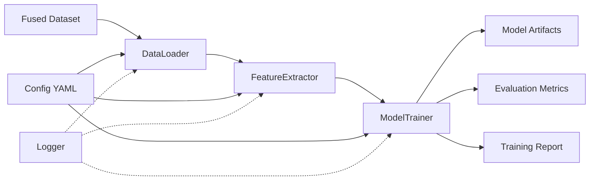

# Design Document: ML Model Training Pipeline

## Overview

The ML Model Training Pipeline is a comprehensive system that transforms labeled security event data into production-ready machine learning models for the ModIntel AI-enhanced ModSecurity system. The pipeline orchestrates the complete workflow from data loading through feature extraction, model training, evaluation, and artifact serialization.

### Purpose

The training pipeline addresses the critical need to reduce false positives in ModSecurity deployments by training machine learning models that can accurately classify web application firewall alerts. It processes the fused dataset created during data exploration and produces trained models with comprehensive evaluation metrics for deployment to the MLClassifier component.

### Key Design Goals

1. **Reproducibility**: All training runs must be reproducible through fixed random seeds and version tracking
2. **Modularity**: Clear separation between feature extraction, model training, and evaluation logic
3. **Extensibility**: Easy addition of new algorithms and feature extraction methods
4. **Robustness**: Graceful error handling with detailed logging for debugging
5. **Production-Ready**: Generate artifacts in formats ready for immediate deployment

### System Context

The training pipeline operates as an offline batch process that:
- Consumes: `data/processed/master_fused_payloads.csv` (fused dataset from data exploration)
- Produces: Trained models, feature extractors, evaluation metrics, and training reports in the `models/` directory
- Integrates with: MLClassifier component (consumes trained models for real-time inference)

## Architecture

### High-Level Architecture

The training pipeline follows a linear workflow architecture with three primary components:



### Component Responsibilities

**DataLoader**
- Load and validate the fused dataset from CSV
- Perform data cleaning (remove missing values, normalize labels)
- Split data into training and test sets using stratified sampling
- Log dataset statistics and label distributions

**FeatureExtractor**
- Convert raw payload text into numerical feature vectors
- Implement TF-IDF vectorization with character n-grams
- Fit vectorizer on training data only (prevent data leakage)
- Transform both training and test sets
- Serialize fitted vectorizer for production use

**ModelTrainer**
- Train multiple ML algorithms in parallel (algorithm tournament)
- Evaluate each model on the test set
- Calculate comprehensive performance metrics
- Select best performing model based on F1-score
- Serialize all trained models and metadata

**ConfigurationManager**
- Load training configuration from YAML file
- Provide default values for all parameters
- Validate configuration parameters
- Support both file-based and programmatic configuration

**Logger**
- Centralized logging for all pipeline components
- Log to both console and file (`logs/training_errors.log`)
- Include timestamps, component names, and severity levels
- Capture stack traces for errors

### Data Flow

1. **Configuration Loading**: Load `config/training_config.yaml` with parameters for all pipeline stages
2. **Data Loading**: Read CSV → Validate schema → Clean data → Log statistics
3. **Data Splitting**: Stratified split (80/20) → Log split statistics
4. **Feature Extraction**: Fit TF-IDF on training set → Transform both sets → Save vectorizer
5. **Model Training**: For each algorithm → Train → Evaluate → Log metrics
6. **Model Selection**: Compare F1-scores → Select best → Save best model
7. **Artifact Generation**: Save all models → Save metrics JSON → Generate training report

### Error Handling Strategy

The pipeline implements a tiered error handling approach:

**Fatal Errors** (terminate pipeline):
- Missing or corrupted fused dataset
- Invalid dataset schema (missing required columns)
- Feature extraction failure
- All algorithms fail to train
- Artifact serialization failure

**Non-Fatal Errors** (log and continue):
- Individual algorithm training failure (continue with remaining algorithms)
- Incremental training comparison warnings

**Error Recovery**:
- All errors logged with full stack traces to `logs/training_errors.log`
- Non-zero exit codes for fatal errors
- Partial results saved when possible (e.g., if 2 of 3 algorithms succeed)

## Components and Interfaces

### DataLoader Component

**Class**: `DataLoader`

**Responsibilities**:
- Load CSV data with pandas
- Validate required columns exist
- Clean data (remove nulls, normalize labels)
- Perform stratified train/test split
- Provide data statistics

**Interface**:
```python
class DataLoader:
    def __init__(self, data_path: str, test_size: float = 0.2, random_seed: int = 42):
        """Initialize data loader with configuration."""
        
    def load_and_validate(self) -> pd.DataFrame:
        """Load CSV and validate schema. Raises ValueError if invalid."""
        
    def clean_data(self, df: pd.DataFrame) -> pd.DataFrame:
        """Remove missing values and normalize labels to binary format."""
        
    def split_data(self, df: pd.DataFrame) -> Tuple[pd.DataFrame, pd.DataFrame]:
        """Perform stratified train/test split. Returns (train_df, test_df)."""
        
    def get_statistics(self, df: pd.DataFrame) -> Dict[str, Any]:
        """Calculate and return dataset statistics."""
```

**Configuration Parameters**:
- `data_path`: Path to fused dataset CSV (default: `data/processed/master_fused_payloads.csv`)
- `test_size`: Fraction of data for test set (default: 0.2)
- `random_seed`: Random seed for reproducible splits (default: 42)

**Error Conditions**:
- `FileNotFoundError`: Dataset file does not exist
- `ValueError`: Missing required columns (payload, label, source_file)
- `ValueError`: Empty dataset after cleaning

### FeatureExtractor Component

**Class**: `FeatureExtractor`

**Responsibilities**:
- Convert text payloads to numerical feature vectors
- Implement TF-IDF vectorization with character n-grams
- Fit vectorizer on training data only
- Transform training and test data
- Serialize fitted vectorizer

**Interface**:
```python
class FeatureExtractor:
    def __init__(self, max_features: int = 5000, ngram_range: Tuple[int, int] = (2, 5)):
        """Initialize feature extractor with TF-IDF parameters."""
        
    def fit(self, payloads: pd.Series) -> 'FeatureExtractor':
        """Fit TF-IDF vectorizer on training payloads."""
        
    def transform(self, payloads: pd.Series) -> scipy.sparse.csr_matrix:
        """Transform payloads to feature vectors using fitted vectorizer."""
        
    def fit_transform(self, payloads: pd.Series) -> scipy.sparse.csr_matrix:
        """Fit and transform in one step (training data only)."""
        
    def save(self, path: str) -> None:
        """Serialize fitted vectorizer to disk using joblib."""
        
    @staticmethod
    def load(path: str) -> 'FeatureExtractor':
        """Load fitted vectorizer from disk."""
        
    def get_feature_names(self) -> List[str]:
        """Return list of feature names (character n-grams)."""
```

**Configuration Parameters**:
- `max_features`: Maximum vocabulary size (default: 5000)
- `ngram_range`: Character n-gram range (default: (2, 5))
- `analyzer`: Analysis level (default: 'char' for character-level)

**Implementation Details**:
- Uses `sklearn.feature_extraction.text.TfidfVectorizer`
- Character n-grams capture attack patterns (e.g., SQL injection syntax)
- Sparse matrix representation for memory efficiency
- Vocabulary limited to most frequent terms to prevent overfitting

**Error Conditions**:
- `ValueError`: Empty payload list during fit
- `NotFittedError`: Transform called before fit
- `IOError`: Serialization failure

### ModelTrainer Component

**Class**: `ModelTrainer`

**Responsibilities**:
- Train multiple ML algorithms (algorithm tournament)
- Evaluate models on test set
- Calculate comprehensive metrics
- Select best performing model
- Serialize models and metadata

**Interface**:
```python
class ModelTrainer:
    def __init__(self, algorithms: List[str], random_seed: int = 42):
        """Initialize trainer with list of algorithms to train."""
        
    def train_algorithm(self, algorithm: str, X_train, y_train) -> Any:
        """Train a single algorithm. Returns trained model or None on failure."""
        
    def evaluate_model(self, model: Any, X_test, y_test) -> Dict[str, float]:
        """Evaluate model and return metrics dict."""
        
    def train_all(self, X_train, y_train, X_test, y_test) -> Dict[str, Any]:
        """Train all algorithms and return results dict."""
        
    def select_best_model(self, results: Dict[str, Any]) -> Tuple[str, Any, Dict]:
        """Select best model by F1-score. Returns (name, model, metrics)."""
        
    def save_model(self, model: Any, path: str) -> None:
        """Serialize model to disk using joblib."""
        
    def save_metadata(self, metadata: Dict, path: str) -> None:
        """Save model metadata to JSON file."""
```

**Supported Algorithms**:
1. **RandomForest**: `sklearn.ensemble.RandomForestClassifier`
   - Parameters: `n_estimators=100`, `class_weight='balanced'`, `random_state=seed`
   
2. **SVM**: `sklearn.svm.SVC`
   - Parameters: `kernel='rbf'`, `class_weight='balanced'`, `random_state=seed`
   
3. **LogisticRegression**: `sklearn.linear_model.LogisticRegression`
   - Parameters: `penalty='l2'`, `class_weight='balanced'`, `random_state=seed`, `max_iter=1000`

**Evaluation Metrics**:
- Accuracy: `(TP + TN) / (TP + TN + FP + FN)`
- Precision: `TP / (TP + FP)`
- Recall: `TP / (TP + FN)`
- F1-Score: `2 * (Precision * Recall) / (Precision + Recall)`
- False Positive Rate: `FP / (FP + TN)`
- Confusion Matrix: 2x2 matrix of TP, FP, TN, FN

**Model Selection Logic**:
1. Rank models by F1-score (descending)
2. If tie, select model with lowest false positive rate
3. If still tied, select first in alphabetical order

**Error Conditions**:
- Individual algorithm training failures are logged but non-fatal
- If all algorithms fail, raise `RuntimeError`
- Serialization failures raise `IOError`

### TrainingPipeline Component

**Class**: `TrainingPipeline`

**Responsibilities**:
- Orchestrate the complete training workflow
- Coordinate all components
- Generate comprehensive training report
- Handle top-level error management

**Interface**:
```python
class TrainingPipeline:
    def __init__(self, config_path: str = 'config/training_config.yaml'):
        """Initialize pipeline with configuration."""
        
    def run(self) -> Dict[str, Any]:
        """Execute complete training pipeline. Returns results dict."""
        
    def generate_report(self, results: Dict[str, Any]) -> str:
        """Generate human-readable training report."""
        
    def save_report(self, report: str, path: str) -> None:
        """Save training report to text file."""
```

**Workflow Steps**:
1. Load configuration
2. Initialize logger
3. Load and validate data
4. Split data
5. Extract features
6. Train all algorithms
7. Select best model
8. Save all artifacts
9. Generate and save report
10. Return results

## Data Models

### Configuration Schema

**File**: `config/training_config.yaml`

```yaml
# Data Configuration
data:
  input_path: "data/processed/master_fused_payloads.csv"
  test_size: 0.2
  random_seed: 42

# Feature Extraction Configuration
features:
  max_features: 5000
  ngram_range: [2, 5]
  analyzer: "char"

# Model Training Configuration
training:
  algorithms:
    - "RandomForest"
    - "SVM"
    - "LogisticRegression"
  random_seed: 42
  
  # Algorithm-specific parameters
  random_forest:
    n_estimators: 100
    class_weight: "balanced"
    
  svm:
    kernel: "rbf"
    class_weight: "balanced"
    
  logistic_regression:
    penalty: "l2"
    max_iter: 1000
    class_weight: "balanced"

# Output Configuration
output:
  models_dir: "models"
  logs_dir: "logs"
  
# Incremental Training Configuration (optional)
incremental:
  enabled: false
  previous_model_path: null
  version_number: 1
```

### Dataset Schema

**Input**: `data/processed/master_fused_payloads.csv`

Required columns:
- `payload` (string): Raw HTTP request payload text
- `label` (int/string): Binary label (0/benign, 1/malicious, or string variants)
- `source_file` (string): Original source file for traceability

Optional columns (ignored by pipeline):
- Any additional metadata columns

**Label Normalization**:
- Input: `0`, `"0"`, `"benign"`, `"normal"` → Output: `0`
- Input: `1`, `"1"`, `"malicious"`, `"attack"` → Output: `1`

### Model Artifacts

**Directory Structure**: `models/`

```
models/
├── feature_extractor.pkl          # Serialized TF-IDF vectorizer
├── random_forest_model.pkl        # Trained RandomForest model
├── svm_model.pkl                  # Trained SVM model
├── logistic_regression_model.pkl  # Trained LogisticRegression model
├── best_model.pkl                 # Copy of best performing model
├── model_metadata.json            # Metadata for best model
├── evaluation_metrics.json        # Metrics for all models
└── training_report.txt            # Human-readable training report
```

**model_metadata.json Schema**:
```json
{
  "algorithm_name": "RandomForest",
  "training_date": "2024-01-15T10:30:00Z",
  "feature_count": 5000,
  "training_samples": 8000,
  "test_samples": 2000,
  "random_seed": 42,
  "library_versions": {
    "scikit-learn": "1.3.0",
    "pandas": "2.0.3",
    "numpy": "1.24.3"
  },
  "metrics": {
    "accuracy": 0.95,
    "precision": 0.93,
    "recall": 0.94,
    "f1_score": 0.935,
    "false_positive_rate": 0.03
  },
  "confusion_matrix": {
    "true_positives": 940,
    "false_positives": 60,
    "true_negatives": 940,
    "false_negatives": 60
  },
  "version": 1
}
```

**evaluation_metrics.json Schema**:
```json
{
  "RandomForest": {
    "accuracy": 0.95,
    "precision": 0.93,
    "recall": 0.94,
    "f1_score": 0.935,
    "false_positive_rate": 0.03,
    "training_time_seconds": 12.5,
    "confusion_matrix": [[940, 60], [60, 940]]
  },
  "SVM": {
    "accuracy": 0.92,
    "precision": 0.90,
    "recall": 0.91,
    "f1_score": 0.905,
    "false_positive_rate": 0.05,
    "training_time_seconds": 45.2,
    "confusion_matrix": [[900, 100], [80, 920]]
  },
  "LogisticRegression": {
    "accuracy": 0.89,
    "precision": 0.87,
    "recall": 0.88,
    "f1_score": 0.875,
    "false_positive_rate": 0.07,
    "training_time_seconds": 3.1,
    "confusion_matrix": [[860, 140], [100, 900]]
  },
  "best_model": "RandomForest"
}
```

### Training Report Format

**File**: `models/training_report.txt`

```
================================================================================
ML MODEL TRAINING REPORT
================================================================================

Training Start: 2024-01-15 10:30:00
Training End: 2024-01-15 10:31:15
Total Duration: 75.3 seconds

--------------------------------------------------------------------------------
DATASET STATISTICS
--------------------------------------------------------------------------------
Total Records: 10,000
Training Set: 8,000 (80.0%)
Test Set: 2,000 (20.0%)

Label Distribution (Training):
  Benign: 4,200 (52.5%)
  Malicious: 3,800 (47.5%)

Label Distribution (Test):
  Benign: 1,050 (52.5%)
  Malicious: 950 (47.5%)

--------------------------------------------------------------------------------
FEATURE EXTRACTION
--------------------------------------------------------------------------------
Method: TF-IDF with Character N-grams
N-gram Range: (2, 5)
Max Features: 5,000
Feature Vector Dimensionality: 5,000

--------------------------------------------------------------------------------
MODEL TRAINING RESULTS
--------------------------------------------------------------------------------

Algorithm: RandomForest
  Training Time: 12.5 seconds
  Accuracy: 95.0%
  Precision: 93.0%
  Recall: 94.0%
  F1-Score: 93.5%
  False Positive Rate: 3.0%
  Confusion Matrix:
    [[940  60]
     [ 60 940]]

Algorithm: SVM
  Training Time: 45.2 seconds
  Accuracy: 92.0%
  Precision: 90.0%
  Recall: 91.0%
  F1-Score: 90.5%
  False Positive Rate: 5.0%
  Confusion Matrix:
    [[900 100]
     [ 80 920]]

Algorithm: LogisticRegression
  Training Time: 3.1 seconds
  Accuracy: 89.0%
  Precision: 87.0%
  Recall: 88.0%
  F1-Score: 87.5%
  False Positive Rate: 7.0%
  Confusion Matrix:
    [[860 140]
     [100 900]]

--------------------------------------------------------------------------------
BEST MODEL SELECTION
--------------------------------------------------------------------------------
Selected Algorithm: RandomForest
Selection Criteria: Highest F1-Score (93.5%)
Model Saved: models/best_model.pkl

--------------------------------------------------------------------------------
ARTIFACTS GENERATED
--------------------------------------------------------------------------------
- models/feature_extractor.pkl
- models/random_forest_model.pkl
- models/svm_model.pkl
- models/logistic_regression_model.pkl
- models/best_model.pkl
- models/model_metadata.json
- models/evaluation_metrics.json
- models/training_report.txt

--------------------------------------------------------------------------------
REPRODUCIBILITY INFORMATION
--------------------------------------------------------------------------------
Random Seed: 42
Library Versions:
  - scikit-learn: 1.3.0
  - pandas: 2.0.3
  - numpy: 1.24.3

================================================================================
END OF REPORT
================================================================================
```


## Correctness Properties

*A property is a characteristic or behavior that should hold true across all valid executions of a system—essentially, a formal statement about what the system should do. Properties serve as the bridge between human-readable specifications and machine-verifiable correctness guarantees.*

### Property Reflection

After analyzing all acceptance criteria, I identified several areas of redundancy:

**Redundancy Group 1: Logging Properties**
- Multiple criteria test that logs contain specific information (record counts, distributions, metrics, file paths, etc.)
- These can be consolidated into fewer comprehensive properties about log completeness

**Redundancy Group 2: Metric Calculation Properties**
- Individual properties for accuracy, precision, recall, FPR calculations
- These are all part of the same evaluation process and can be combined

**Redundancy Group 3: Serialization Properties**
- Multiple criteria test saving to specific file paths
- These can be consolidated into properties about serialization behavior

**Redundancy Group 4: Configuration Properties**
- Multiple criteria test specific algorithm configurations
- These are examples rather than universal properties

After reflection, the following properties provide unique validation value without redundancy:

### Property 1: Dataset Schema Validation

*For any* CSV file loaded by the DataLoader, if the file exists and is readable, then validation should verify the presence of required columns (payload, label, source_file) and either succeed with all columns present or fail with a descriptive error message.

**Validates: Requirements 1.3, 1.4**

### Property 2: Data Cleaning Completeness

*For any* dataset loaded by the DataLoader, after cleaning, the resulting dataset should contain no records with missing payload or label values.

**Validates: Requirements 1.6**

### Property 3: Label Normalization Consistency

*For any* label value in the input dataset (whether numeric or string), the DataLoader should normalize it to binary format (0 for benign variants, 1 for malicious variants), and all normalized labels should be either 0 or 1.

**Validates: Requirements 1.7**

### Property 4: Train-Test Split Ratio

*For any* dataset split by the DataLoader with test_size=0.2, the training set should contain 80% of records (±1 record for rounding) and the test set should contain 20% of records (±1 record for rounding).

**Validates: Requirements 2.1, 2.2**

### Property 5: Stratified Sampling Preservation

*For any* dataset split using stratified sampling, the label distribution in the training set and test set should match the original dataset distribution within a tolerance of ±2 percentage points.

**Validates: Requirements 2.3**

### Property 6: Split Reproducibility

*For any* dataset, when split multiple times with the same random seed, the resulting training and test sets should be identical across all splits.

**Validates: Requirements 2.4, 10.4**

### Property 7: Feature Vector Dimensionality

*For any* text corpus transformed by the FeatureExtractor with max_features=N, the resulting feature vectors should have dimensionality ≤ N (equal to N if corpus contains at least N unique n-grams, less if corpus is smaller).

**Validates: Requirements 3.2, 11.7**

### Property 8: Feature Extraction Consistency

*For any* FeatureExtractor fitted on training data, transforming the same payload text multiple times should produce identical feature vectors.

**Validates: Requirements 3.1, 3.5**

### Property 9: Feature Extractor Serialization Round-Trip

*For any* fitted FeatureExtractor, after saving to disk and loading back, transforming the same payload text should produce identical feature vectors as the original extractor.

**Validates: Requirements 11.3**

### Property 10: Model Training Completeness

*For any* list of algorithms configured for training, the ModelTrainer should attempt to train each algorithm on the training set, and for each successful training, produce a trained model object.

**Validates: Requirements 4.4**

### Property 11: Evaluation Metrics Calculation

*For any* trained model evaluated on a test set, the calculated metrics (accuracy, precision, recall, F1-score, FPR) should satisfy mathematical relationships: accuracy = (TP+TN)/(TP+TN+FP+FN), precision = TP/(TP+FP), recall = TP/(TP+FN), F1 = 2×(precision×recall)/(precision+recall), FPR = FP/(FP+TN), where TP, TN, FP, FN are from the confusion matrix.

**Validates: Requirements 5.2, 5.3, 5.4, 5.5, 5.6**

### Property 12: Best Model Selection by F1-Score

*For any* set of trained models with evaluation metrics, the model selected as "best" should have the highest F1-score among all models, or if multiple models tie for highest F1-score, the one with the lowest false positive rate.

**Validates: Requirements 6.2, 6.3, 6.4**

### Property 13: Model Serialization Format

*For any* trained model serialized by the ModelTrainer, the file should be in joblib format and loadable using joblib.load(), producing a model object with the same type as the original.

**Validates: Requirements 7.1**

### Property 14: Model Artifact File Naming

*For any* algorithm trained by the ModelTrainer, the saved model file should be named "{algorithm_name}_model.pkl" where algorithm_name matches the algorithm identifier (e.g., "random_forest", "svm", "logistic_regression").

**Validates: Requirements 7.2**

### Property 15: Metadata Completeness

*For any* trained model, the generated model_metadata.json file should contain all required fields: algorithm_name, training_date, feature_count, training_samples, test_samples, random_seed, library_versions, metrics, confusion_matrix, and version.

**Validates: Requirements 7.4, 10.3, 10.6**

### Property 16: Training Report Completeness

*For any* completed training run, the generated training report should contain all required sections: dataset statistics, feature extraction details, per-algorithm evaluation metrics, best model selection, artifacts generated, and reproducibility information.

**Validates: Requirements 8.2, 8.3, 8.5, 8.6**

### Property 17: Error Logging Completeness

*For any* error that occurs during pipeline execution, the error log should contain a timestamp, error message, and stack trace.

**Validates: Requirements 9.5**

### Property 18: Non-Zero Exit Code on Error

*For any* fatal error during pipeline execution (missing dataset, feature extraction failure, all algorithms failing), the pipeline should terminate with a non-zero exit code.

**Validates: Requirements 9.7**

### Property 19: Partial Success Handling

*For any* training run where at least one algorithm succeeds and at least one fails, the pipeline should save the successful model(s) and continue to completion rather than terminating.

**Validates: Requirements 4.7, 9.4**

### Property 20: Random Seed Consistency

*For any* pipeline execution with a specified random seed, all random operations (data splitting, model training) should use that seed, ensuring reproducibility.

**Validates: Requirements 10.1**

### Property 21: Incremental Training Data Combination

*For any* incremental training run with existing training data and new data, the combined training set should contain all records from both the existing and new datasets.

**Validates: Requirements 12.2**

### Property 22: Incremental Training Version Increment

*For any* incremental training run, the new model's version number in model_metadata.json should be exactly one greater than the previous model's version number.

**Validates: Requirements 12.6, 12.7**

## Error Handling

### Error Categories

The pipeline implements a three-tier error handling strategy:

**Tier 1: Fatal Errors (Immediate Termination)**
- Missing or unreadable fused dataset file
- Invalid dataset schema (missing required columns)
- Empty dataset after cleaning
- Feature extraction failure (vectorizer fit fails)
- All algorithms fail to train
- Critical artifact serialization failure (best model, feature extractor)

**Tier 2: Non-Fatal Errors (Log and Continue)**
- Individual algorithm training failure (continue with remaining algorithms)
- Non-critical artifact serialization failure (individual algorithm models)
- Incremental training performance degradation (log warning)

**Tier 3: Warnings (Log Only)**
- Vocabulary size mismatch after loading feature extractor
- New model performs worse than previous model in incremental training
- Class imbalance detected in dataset

### Error Handling Mechanisms

**Exception Hierarchy**:
```python
PipelineError (base exception)
├── DataLoadError (fatal)
│   ├── FileNotFoundError
│   ├── SchemaValidationError
│   └── EmptyDatasetError
├── FeatureExtractionError (fatal)
│   ├── VectorizerFitError
│   └── TransformError
├── ModelTrainingError (non-fatal for individual algorithms)
│   ├── AlgorithmTrainingError
│   └── AllAlgorithmsFailedError (fatal)
└── ArtifactSerializationError (fatal for critical artifacts)
    ├── ModelSaveError
    └── MetadataSaveError
```

**Error Recovery Strategies**:

1. **Graceful Degradation**: If some algorithms fail but at least one succeeds, save partial results
2. **Detailed Logging**: All errors logged with full context (timestamp, component, stack trace)
3. **Clean Termination**: Ensure partial artifacts are not left in inconsistent state
4. **User Feedback**: Descriptive error messages guide users to resolution

**Logging Configuration**:
- Console handler: INFO level and above
- File handler (`logs/training_errors.log`): DEBUG level and above
- Format: `[%(asctime)s] %(levelname)s [%(name)s] %(message)s`
- Rotation: Daily rotation with 7-day retention

### Error Scenarios and Responses

| Scenario | Error Type | Response | Exit Code |
|----------|-----------|----------|-----------|
| Dataset file not found | Fatal | Log error, terminate | 1 |
| Missing required columns | Fatal | Log error with column names, terminate | 2 |
| Empty dataset after cleaning | Fatal | Log error with original size, terminate | 3 |
| Feature extraction fails | Fatal | Log error with stack trace, terminate | 4 |
| RandomForest training fails | Non-Fatal | Log error, continue with SVM and LogReg | 0 |
| All algorithms fail | Fatal | Log error, terminate | 5 |
| Best model save fails | Fatal | Log error, terminate | 6 |
| Individual model save fails | Non-Fatal | Log warning, continue | 0 |
| Incremental model worse | Warning | Log warning, save anyway | 0 |

## Testing Strategy

### Dual Testing Approach

The ML Model Training Pipeline requires comprehensive testing using both unit tests and property-based tests. These approaches are complementary:

**Unit Tests**: Validate specific examples, edge cases, and integration points
**Property Tests**: Verify universal properties across randomized inputs

Together, they provide comprehensive coverage where unit tests catch concrete bugs and property tests verify general correctness.

### Unit Testing Strategy

**Test Framework**: pytest

**Test Organization**:
```
tests/
├── unit/
│   ├── test_data_loader.py
│   ├── test_feature_extractor.py
│   ├── test_model_trainer.py
│   ├── test_training_pipeline.py
│   └── test_config_manager.py
├── integration/
│   ├── test_end_to_end_pipeline.py
│   └── test_artifact_compatibility.py
└── fixtures/
    ├── sample_datasets.py
    └── mock_models.py
```

**Unit Test Focus Areas**:

1. **Specific Examples**:
   - Load a known CSV file with expected structure
   - Transform a specific payload and verify expected features
   - Train on a small synthetic dataset with known optimal model

2. **Edge Cases**:
   - Empty dataset
   - Dataset with all same label
   - Single-record dataset
   - Payloads with special characters, Unicode, very long strings
   - All algorithms fail to train
   - Tie in F1-scores requiring FPR tiebreaker

3. **Integration Points**:
   - DataLoader → FeatureExtractor handoff
   - FeatureExtractor → ModelTrainer handoff
   - ModelTrainer → Artifact serialization
   - Configuration loading and validation

4. **Error Handling**:
   - Missing file triggers correct exception
   - Invalid schema triggers correct exception
   - Serialization failures handled correctly

**Example Unit Tests**:
```python
def test_load_valid_dataset():
    """Test loading a valid CSV file with correct schema."""
    loader = DataLoader("tests/fixtures/valid_dataset.csv")
    df = loader.load_and_validate()
    assert len(df) > 0
    assert all(col in df.columns for col in ['payload', 'label', 'source_file'])

def test_missing_file_raises_error():
    """Test that missing file raises FileNotFoundError."""
    loader = DataLoader("nonexistent.csv")
    with pytest.raises(FileNotFoundError):
        loader.load_and_validate()

def test_label_normalization():
    """Test that various label formats are normalized correctly."""
    loader = DataLoader()
    test_cases = [
        ("0", 0), ("1", 1),
        ("benign", 0), ("malicious", 1),
        (0, 0), (1, 1)
    ]
    for input_label, expected in test_cases:
        assert loader.normalize_label(input_label) == expected
```

### Property-Based Testing Strategy

**Test Framework**: Hypothesis (Python property-based testing library)

**Configuration**:
- Minimum 100 iterations per property test (due to randomization)
- Deadline: 5 seconds per test case
- Verbosity: Show failing examples

**Property Test Focus Areas**:

1. **Data Transformations**:
   - Any dataset split maintains size invariant
   - Any label normalization produces only 0 or 1
   - Any feature extraction produces correct dimensionality

2. **Round-Trip Properties**:
   - Save then load feature extractor produces identical transformations
   - Save then load model produces identical predictions

3. **Mathematical Invariants**:
   - Metric calculations satisfy mathematical relationships
   - Train/test split ratios are correct
   - Stratification preserves distributions

4. **Reproducibility**:
   - Same seed produces identical results
   - Multiple runs with same seed are deterministic

**Property Test Implementation**:

Each property test must reference its design document property using a comment tag:

```python
# Feature: ml-model-training, Property 6: Split Reproducibility
@given(
    dataset=datasets_strategy(),
    random_seed=st.integers(min_value=0, max_value=2**32-1)
)
@settings(max_examples=100)
def test_split_reproducibility(dataset, random_seed):
    """For any dataset, splits with same seed produce identical results."""
    loader = DataLoader(random_seed=random_seed)
    
    # First split
    train1, test1 = loader.split_data(dataset)
    
    # Second split with same seed
    loader2 = DataLoader(random_seed=random_seed)
    train2, test2 = loader2.split_data(dataset)
    
    # Assert identical splits
    assert train1.equals(train2)
    assert test1.equals(test2)
```

**Hypothesis Strategies**:

```python
import hypothesis.strategies as st
from hypothesis import given, settings

# Strategy for generating valid datasets
@st.composite
def datasets_strategy(draw):
    """Generate random valid datasets for testing."""
    n_records = draw(st.integers(min_value=10, max_value=1000))
    payloads = [draw(st.text(min_size=1, max_size=200)) for _ in range(n_records)]
    labels = [draw(st.sampled_from([0, 1, "0", "1", "benign", "malicious"])) 
              for _ in range(n_records)]
    source_files = [f"file_{i}.log" for i in range(n_records)]
    
    return pd.DataFrame({
        'payload': payloads,
        'label': labels,
        'source_file': source_files
    })

# Strategy for generating payload text
@st.composite
def payload_strategy(draw):
    """Generate random payload text including attack patterns."""
    return draw(st.text(
        alphabet=st.characters(blacklist_categories=['Cs']),
        min_size=1,
        max_size=500
    ))
```

**Property Test Coverage**:

Each correctness property from the design document must have a corresponding property-based test:

| Property | Test Function | Hypothesis Strategy |
|----------|---------------|---------------------|
| Property 2: Data Cleaning | `test_data_cleaning_completeness` | `datasets_with_nulls_strategy()` |
| Property 3: Label Normalization | `test_label_normalization_consistency` | `label_variants_strategy()` |
| Property 4: Split Ratio | `test_train_test_split_ratio` | `datasets_strategy()` |
| Property 5: Stratification | `test_stratified_sampling_preservation` | `imbalanced_datasets_strategy()` |
| Property 6: Reproducibility | `test_split_reproducibility` | `datasets_strategy()` + `random_seeds()` |
| Property 7: Dimensionality | `test_feature_vector_dimensionality` | `text_corpus_strategy()` |
| Property 8: Extraction Consistency | `test_feature_extraction_consistency` | `payload_strategy()` |
| Property 9: Serialization Round-Trip | `test_feature_extractor_round_trip` | `fitted_extractors_strategy()` |
| Property 11: Metrics Calculation | `test_evaluation_metrics_calculation` | `predictions_strategy()` |
| Property 12: Best Model Selection | `test_best_model_selection` | `model_results_strategy()` |

### Test Execution

**Local Development**:
```bash
# Run all tests
pytest tests/

# Run only unit tests
pytest tests/unit/

# Run only property tests
pytest tests/property/ -v

# Run with coverage
pytest --cov=src/ml_core --cov-report=html
```

**Continuous Integration**:
- Run full test suite on every commit
- Require 90% code coverage for ml_core module
- Property tests run with 100 examples in CI
- Fail build on any test failure

### Test Data Management

**Fixtures**:
- Small synthetic datasets (10-100 records) for unit tests
- Larger generated datasets (1000+ records) for integration tests
- Known-good model artifacts for compatibility testing

**Test Isolation**:
- Each test uses temporary directories for artifacts
- Cleanup after each test to prevent state leakage
- Mock external dependencies (file system, time)

### Performance Testing

While not part of correctness validation, performance benchmarks should be tracked:

**Benchmarks**:
- Data loading time for 10K, 100K, 1M records
- Feature extraction time for various corpus sizes
- Training time for each algorithm
- End-to-end pipeline time

**Performance Regression Detection**:
- Track benchmark results over time
- Alert if performance degrades >20% between versions

